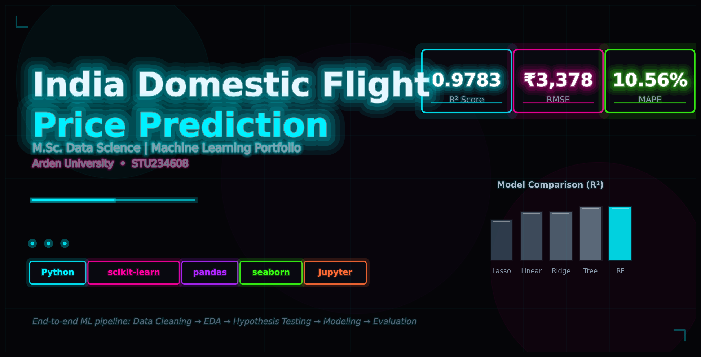

# India Domestic Flight Price Prediction

> **M.Sc. Data Science Portfolio Project | Arden University**
> 
> End-to-end machine learning pipeline predicting Indian domestic flight prices using statistical inference and ensemble methods.

---

## Project Overview

The aviation sector operates as a volatile marketplace where fares shift dynamically with booking timelines, route coordination, and demand cycles. This project examines India's domestic flight pricing using statistical inference and predictive algorithms to decode cost drivers and project fare behavior.

**Key Results:**
- **Best Model:** Random Forest Regressor
- **Performance:** R² = 0.9783 | RMSE = ₹3,378 | MAPE = 10.56%
- **Top Insight:** Travel class alone drives 83% of price variation (Business class is ~698% more expensive than Economy)

---

## Dataset

- **Source:** Indian domestic flight dataset (`Flight_dataset.xlsx`)
- **Size:** 300,153 records × 12 features
- **Target Variable:** Ticket price (INR)
- **Features:** Airline, source city, destination city, departure/arrival time, stops, duration, days left, class
- **Carriers:** SpiceJet, Vistara, Air India, IndiGo, AirAsia, GO_FIRST

---

## Methodology

| Phase | Description |
|-------|-------------|
| **1. Data Audit** | Loaded raw data, identified missing values (22), duplicates (2,212), and schema issues |
| **2. Preprocessing** | Removed identifiers, standardized text, imputed missing values, capped outliers (IQR method) |
| **3. Feature Engineering** | Created `route` (30 directional pairs) and `duration_bucket` (4 time bands) |
| **4. EDA** | Distribution analysis, correlation heatmaps, airline/class/route price breakdowns |
| **5. Hypothesis Testing** | Welch t-test, ANOVA, Chi-square — all significant at p < 0.001 |
| **6. Modeling** | Trained 5 regressors: Linear, Ridge, Lasso, Decision Tree, Random Forest |
| **7. Evaluation** | Compared R², RMSE, MAE, MAPE; analyzed residuals and feature importance |

---

## Model Comparison

| Model | R² | RMSE (INR) | MAE (INR) | MAPE |
|-------|----|------------|-----------|------|
| **Random Forest** | **0.9783** | **3,378.30** | **1,645.90** | **10.56%** |
| Decision Tree | 0.9681 | 4,094.36 | 2,109.96 | 13.41% |
| Ridge Regression | 0.8836 | 7,817.38 | 4,621.28 | 25.95% |
| Linear Regression | 0.8836 | 7,817.86 | 4,621.47 | 25.95% |
| Lasso Regression | 0.7346 | 11,805.04 | 7,102.17 | 42.08% |

---

## Key Insights

1. **Class Premium Effect:** Business class mean (₹52,591) is 697.95% above economy (₹6,591)
2. **Booking Horizon:** Negative correlation (-0.09) between days_left and price — late bookings cost more
3. **Airline Hierarchy:** Vistara (₹30,495 avg) and Air India (₹23,508) form the premium tier; AirAsia (₹4,099) is budget
4. **Route Effects:** Chennai-Bangalore and Kolkata-Chennai routes carry higher average fares
5. **Feature Importance:** `class_economy` (83%), `days_left` (7%), `duration_minutes` (4.4%)

---

## Tech Stack

- **Language:** Python 3.x
- **Libraries:** pandas, numpy, scikit-learn, seaborn, matplotlib, scipy
- **Environment:** Jupyter Notebook / VS Code
- **Reproducibility:** Fixed random seed (SEED = 42)

---

## How to Run

```bash
# 1. Clone the repository
git clone https://github.com/DATA-Meta/ML-_arden_university.git
cd ML-_arden_university

# 2. Install dependencies
pip install -r requirements.txt

# 3. Launch Jupyter and open notebooks in order
jupyter notebook
```

Run notebooks sequentially (`01` → `02` → `03` → `04`) for full reproducibility.

---

## Project Structure

```
├── README.md
├── requirements.txt
├── data/
│   └── Flight_dataset.xlsx
├── notebooks/
│   ├── 01_data_cleaning.ipynb
│   ├── 02_eda_and_visualization.ipynb
│   ├── 03_hypothesis_testing.ipynb
│   └── 04_model_training.ipynb
├── reports/
│   └── STU234608_ML_Portfolio.pdf
└── .gitignore
```

---

## Author

**Student ID:** STU234608  
**Programme:** M.Sc. Data Science, Arden University  
**Module:** Machine Learning  
**Tutor:** Mohammad Amin Mohammadi Banadaki

---

## References

- James, G. et al. (2023) *An Introduction to Statistical Learning: with Applications in Python*. 2nd edn. Springer.
- Géron, A. (2022) *Hands-On Machine Learning with Scikit-Learn, Keras and TensorFlow*. 3rd edn. O'Reilly.
- Molnar, C. (2022) *Interpretable Machine Learning*. 2nd edn.
- McKinney, W. (2022) *Python for Data Analysis*. 3rd edn. O'Reilly.
- scikit-learn Developers (2024) *scikit-learn: Machine Learning in Python*.

---

*This project was completed as part of academic coursework. Not intended for commercial deployment without further validation.*
